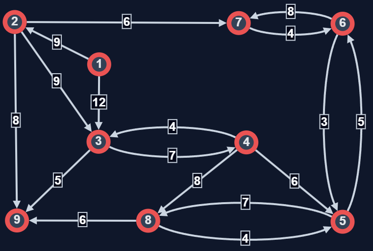
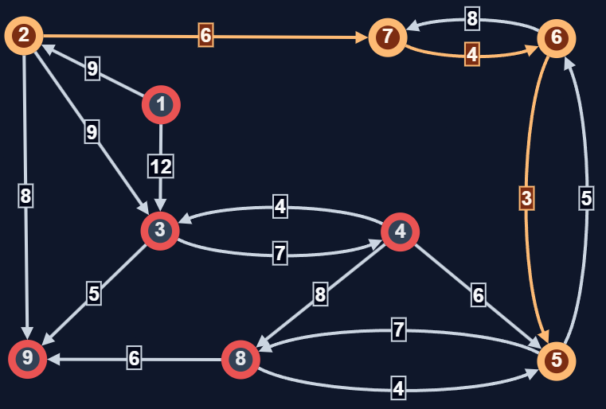
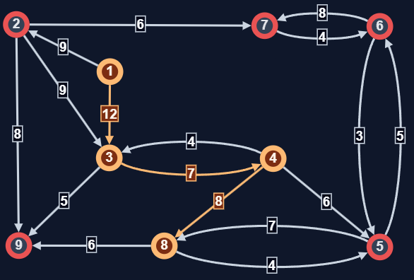

# PROYECTO (Al final dejé instrucciones para probar el sistema)
En esta carpeta esta destinada para los archivos para mi proyecto del curso de Programacion-2026

Mi proyecto consta en un software resolutor de caminos mínimos en gráficas simples y pesos positivos con el algoritmo de Dijkstra

---
## Definiciones:

- **Gráfica simple ponderada:** Una gráfica simple es un par ordenado (V,E) de un conjunto de vertices  no vacío (V) y un conjunto de aristas (E) que cumplen las siguientes caracteristicas:
    + Sin lazos: No hay arista que conecte un vértice consigo mismo.
    + Sin aristas múltiples: Solo puede existir una arista (o ninguna) conectando cualquier par de vértices.
    + Aristas no dirigidas: El orden de los vértices en una arista no importa {u,v}={v,u}
- **Gráfica ponderada:** Dada una gráfica G=(V,E) se considera un tercer conjuto W que consta de una funcion W:V-->R donde se le asigna un "peso" a cada uno de los vertices de G, tambien se puede definir la funcion W a las aristas de G.

- **Algoritmo de Dijkstra:** Dijkstra calcula los caminos mínimos desde un vértice fuente en gráficas ponderadas con
pesos positivos.
    1. Inicialización:
        * Asigna a todos los nodos una distancia infinita.
        * Al nodo origen asígnale distancia 0.
        * Marca todos los nodos como no visitados.
    2. Selección del nodo actual    
        * Elige el nodo no visitado con la menor distancia provisional.
        * Este nodo será el nodo actual.
    3. Relajación de aristas
        * Para cada vecino no visitado del nodo actual:
        * Calcula la distancia desde el origen pasando por el nodo actual.
        * Si esta distancia es menor que la distancia conocida, actualízala.
    4. Marcar como visitado
        * Marca el nodo actual como visitado.
        * Una vez visitado, su distancia ya no se vuelve a modificar.
    5. Repetición
        * Repite los pasos 2 a 4 hasta que:
        * Todos los nodos estén visitados, o
        * Se haya alcanzado el nodo destino.
    6. Resultado
        * Las distancias finales representan los caminos más cortos desde el origen a cada nodo.

## Ejemplo de prueba

Suponiendo que estamos en el metro y queremos movernos entre estaciones usando los transbordos, usaremos como ejemplo las estaciones Pantitlan,Jamaica,Chabacano,Balderas,Hidalgo,LaRaza,Consulado,Tacubaya y CentroMedico con los pesos de la grafica que indican el tiempo entre dichas estaciones.

Para visualizar de mejor forma la grafica que analizaremos ocupé el sitio web https://graphonline.top/en/ para generar la imagen de la gráfica y además ya tiene la herramienta del algoritmo de Dijkstra integrado así que nos será de utilidad para corroborar el resultado de mi sistema. 

En la imagen numeramos los vertices del 1 al 9 en el listado de las estaciones.

A continuación dejo los nombres y la matriz de adyacencia para copiar y pegar en la terminal.

Nombres: 
Pantitlan,Jamaica,Chabacano,Balderas,Hidalgo,LaRaza,Consulado,Tacubaya,CentroMedico

Matriz de adyacencia
0, 9, 12, 0, 0, 0, 0, 0, 0
0, 0,  9, 0, 0, 0, 6, 0, 8
0, 0,  0, 7, 0, 0, 0, 0, 5
0, 0,  4, 0, 6, 0, 0, 8, 0
0, 0,  0, 0, 0, 5, 0, 7, 0
0, 0,  0, 0, 3, 0, 8, 0, 0
0, 0,  0, 0, 0, 4, 0, 0, 0
0, 0,  0, 0, 4, 0, 0, 0, 6
0, 0,  0, 0, 0, 0, 0, 0, 0

### Ejemplo 1 Jamaica - Hidalgo

La ruta que corresponde es Jamaica-->Consulado-->LaRaza-->Hidalgo y la suma es de 13.

### Ejemplo 2 Pantitlan - Tacubaya

El camino que corresponde es Pantitlan-->Chabacano-->Balderas-->Tacubaya y la suma es 27
